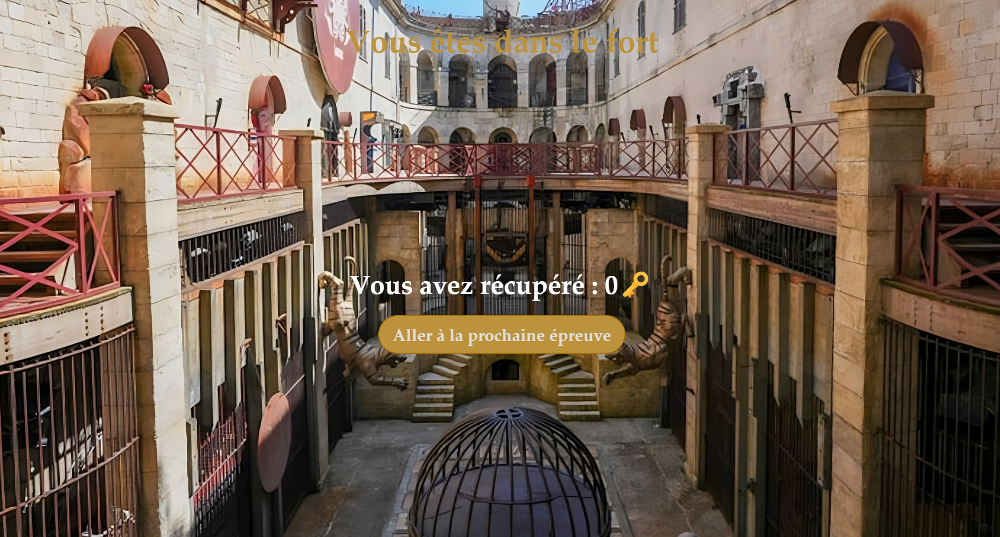

# Fort Boyard Simulator
Projet EFREI TI101 - Programmation en Python

## 1. Présentation Générale

### Contributeurs
- Eliot.C : Tezay
- Eliot.C : CSScooby

### Description
Dans le cadre d'un projet d'école en programmation en Python, nous avons réalisé un mini-jeu qui reprend le concept de Fort Boyard, avec des épreuves variées qui permettent aux joueurs d'obtenir des clés, et d'accéder à la salle au trésor.

Notre projet se démarque par l'utilisation du framework Flask, qui permet une expérience de jeu plus immersive, en proposant une interface personnalisée directement dans le navigateur internet. 

### Fonctionnalités Principales
- Enigmes de mathématiques, logique, chance, et épreuve du Père Fouras.
- Gestion des composants du jeu dans des fichiers JSON.
- Enregistrement des données de partie dans un fichier de log txt.

### Technologies Utilisées
- **Langages de programmation :** Python (pour l'intégralité du backend), HTML, CSS et JavaScript (pour la partie bonus, frontend)
- **Bibliothèques :** Flask, random, json, os, datetime
- **Outils :** VSCode, pyCharm, chatGPT 4o (pour la partie frontend bonus)

### Installation

#### Prérequis :
Python 3.9+, pip, un navigateur internet.

#### 1. Instructions pour cloner le dépôt Git
```bash
git clone https://github.com/Tezay/Fort-Boyard-Simulator.git
cd Fort-Boyard-Simulator
```
#### 2. Configuration de l'environnement de développement (optionnel)
```bash
python -m venv env
```
- Sous Windows :
    ```
    .\env\Scripts\activate
    ```
- Sous macOS/Linux :
    ```
    source env/bin/activate
    ```
#### 3. Installation des dépendances nécessaires
```bash
pip install -r requirements.txt
```
#### 4. Création du fichier de données locales
Dans le dossier `data/`, dupliquer le fichier `local_data_example.json` et le renommer `local_data.json` (commande ci-dessous)
```bash
cp data/local_data_example.json data/local_data.Json
```

### Utilisation
Pour lancer le projet, exécuter le fichier **app.py** (rajouter `-d True` pour lancer en mode débug)
```bash
python app.py
```
Depuis un navigateur, se connecter en local sur le port 5000 (Flask) :
```url
http://127.0.0.1:5000/
```

## 2. Documentation Technique

### 1. Initialisation
1.1 Page d'accueil


1.1 Composition de l'équipe 

- Nombre de joueurs, nom et profession des joueurs 

### 2. Début du jeu
2.1 Entrée sur le fort 


2.2 Choix du joueur qui fera l'épreuve 


2.3 Choix de l'épreuve

- Choix parmi les 4 type d'épreuves suivantes :
  - Mathématiques
  - Logique
  - Aléatoire
  - Pere Fouras 

2.4 Choix aléatoire d'une épreuve pour le type d'épreuve séléctionné

### 3. Début des épreuves 
3.1 Exécution de l'épreuve : 

- Le joueur sélectionné réalise l'épreuve qu'il a choisie.
  
  - Épreuve réussie -> clé gagnée et ajoutée au compteur 
  - Épreuve ratée -> Aucune clé n'est donnée

### 4. Déroulement du jeu

4.1 Chaque type d'épreuve doit être effectuée au minimum 1 fois et au maximum 2 fois 

4.2 Il faut au minimum trois clés pour rentrer dans l'épreuve final 

4.3 Au bout de 5 clés les épreuves s'arrêtent et c'est le passage à l'épreuve finale

### 5. Épreuve finale 

5.1 En fonction du nombre de clés, le même nombre d'indices est donné 

  
  - Trois chances pour réussir l'épreuve finale
  - À chaque essaie raté un indice est ajouté pour aider les joueurs 
  - Si l'énigme est réussie accès à la salle du trésor 

### 6. Salle du trésor


- Récupérer le plus de pièces possible dans le temps imparti (20sec)

## 3. Journal de bords

### 28 nov. 2024

- Création du projet GitHub et répartition du travail :

  - Épreuve Hasard -> Tezay
  - Épreuve Mathématiques -> CSScooby
  

### 5 déc. 2024

- Tezay 

  - Première feature Flask 
  - Épreuve Hasard bonneteau

- CSScooby 
  
  - Épreuve Mathématiques nombres premiers

### 10 déc. 2024

- Tezay 

  - Modification de la vérification des questions pour utiliser uniquement du python

- CSScooby 
  
  - Épreuve Mathématiques roulette et équation linéaire
  - Épreuve Hasard jeu de dé 

### 11 déc. 2024

- Tezay 

  - Optimisation de Flask 
  - Épreuve Hasard bataille navale
  - Optimisation des épreuves

- CSScooby 
  
  - Épreuve Hasard jeu de dé

### 12 et 13 déc. 2024

- Tezay 

  - Optimisation de l'épreuve Hasard bataille navale
  - Prise en compte des fractions dans les épreuves de mathématiques

### 17 déc. 2024

- Tezay 

  - Modification front
  - Correction de Bug

- CSScooby 
  
  - Modification épreuve Mathématiques roulette

### 19 et 20 déc. 2024

- Tezay 

  - Modification Bonneteau
  - Énigmes Père Fouras
  - README

- CSScooby 
  
  - Explication des règles du jeu

### 24 et 25 déc. 2024

- CSScooby 
  
  - Épreuve Mathématiques nombres premiers

### 26 déc. 2024

- Tezay 

  - Épreuve Hasard jeu de dé 
  - Énigmes Père Fouras

### 30 et 31 déc. 2024

- Tezay 

  - Fonction choix des équipes
  - Restructuration Json
  - Épreuve du Tic Tac Toe 

- CSScooby 
  
  - Épreuve de Mathématiques : 3 épreuves
  - Modification des explications des règles

### 1 et 2 jan. 2024

- Tezay 

  - Correction des derniers Bug
  - CSS

- CSScooby 
  
  - Dernière épreuve
  - Correction des derniers Bug

### 3 et 4 jan. 2024 

- Tezay
  
  - CSS
  - Salle du trésor
  - Derniers correctifs
  - README

- CSScooby 

  - README